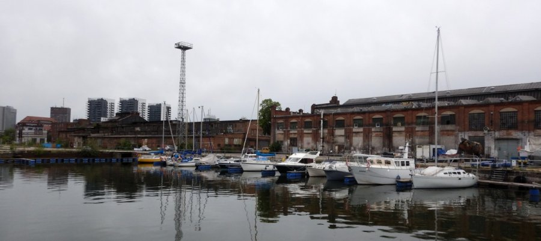
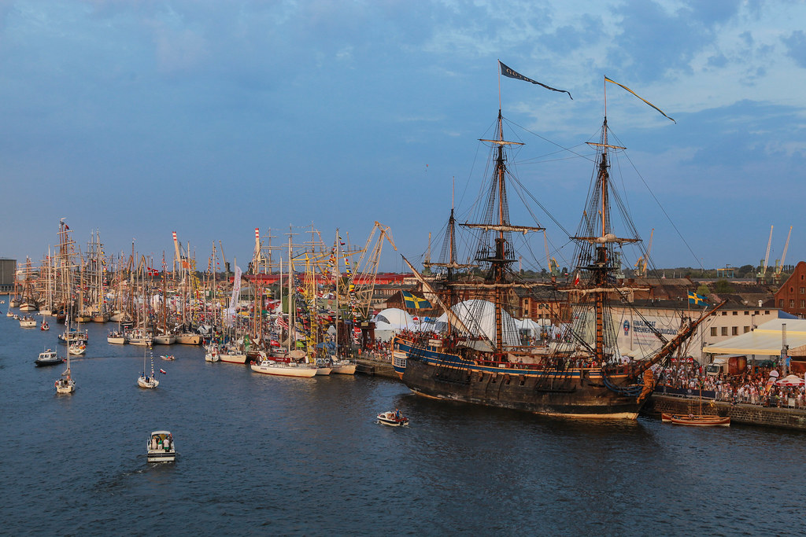
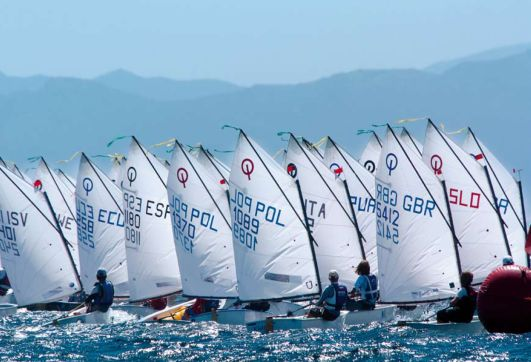

-

## Wstęp

Żeglarstwo jest sportem, który w ostatnich latach zyskał w naszym kraju na popularności. Mimo wszystko nadal wiele osób nie wie o nim zbyt wiele.

Celem tej prezentacji jest przybliżenie wiedzy na temat jachtów żaglowych pływających po polskich wodach. Ich różnorodność może zaskoczyć niejedną osobę.

## Polskie stocznie

Przemysł stoczniowy w naszym kraju działa bardzo prężnie.
Nie inaczej jest w niszy, jaką niewątpliwie jest produkcja jachtów żaglowych. Polskie łodzie i statki są w tej branży znane i cenione na całym świecie. Oto kilku z najpopularniejszych rodzimych producentów:

* **Delphia Yachts**
* **Ostróda Yachts**
* **Northman Shipyard**
* **Antila Yachts**

## Polskie żaglowce
Oprócz niedużych jachtów, na wodach, w szczególności na morzach i oceanach, możemy spotkać także wielkie, majestatyczne żaglowce. Najbardziej znane w Polsce to **Dar Młodzierzy**, **Fryderyk Chopin**, **Pogoria** i **Zawisza Czarny**. Żaglowce z całego świata można podziwiać podczas imprezy Tall Ship Races, która w 2017 roku odbyła się m. in. w Szczecinie.

## Żeglarstwo sportowe

Bez wątpienia żeglarstwo samo w sobie jest sportem, jednak pewne jego odmiany są związane głownie z turystyką. Jednak nie można pomijać równie szerokiej i ciekawej niszy jakim jest żeglarstwo regatowe, czyli wyścigowe. Dzieci od najmłodszych lat ścigają się na małych, kanciastych łódkach klasy Optimist, by w następnych latach przesiąść się na większe i szybsze jachty klasy Laser, 420 i wiele, wiele innych.

